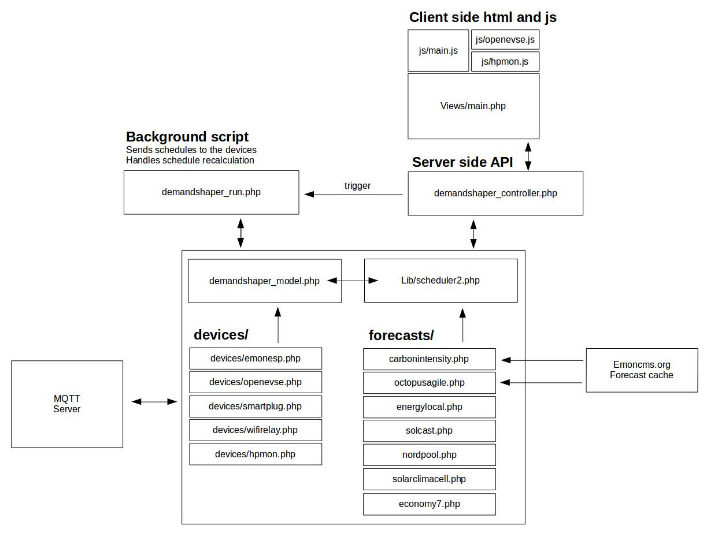

# Developer Guide

Version 2 of the DemandShaper module has been rebuilt from the ground up to be more modular with the intention of making it easier to add new devices and forecasts.

The following guide provides an overview of the architecture of the DemandShaper module and a series of guides on how to add a new forecast and device.

### Architecture

### How to add a new forecast

### How to add a new device
