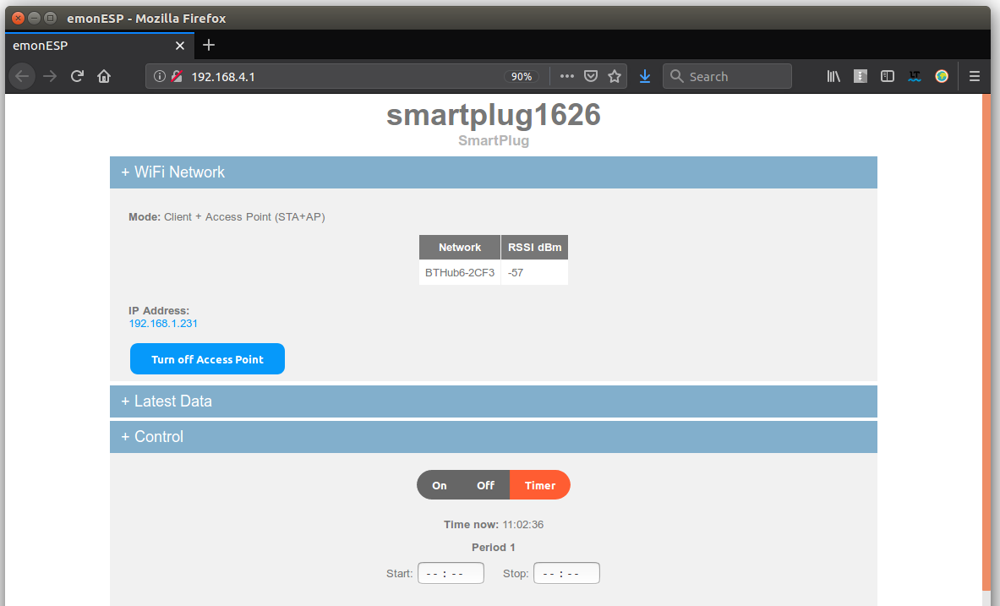
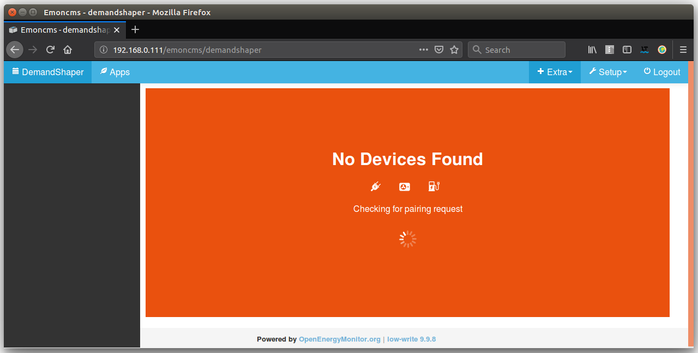
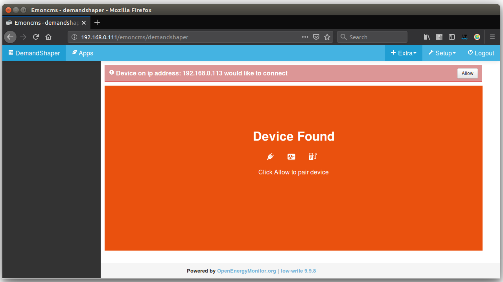
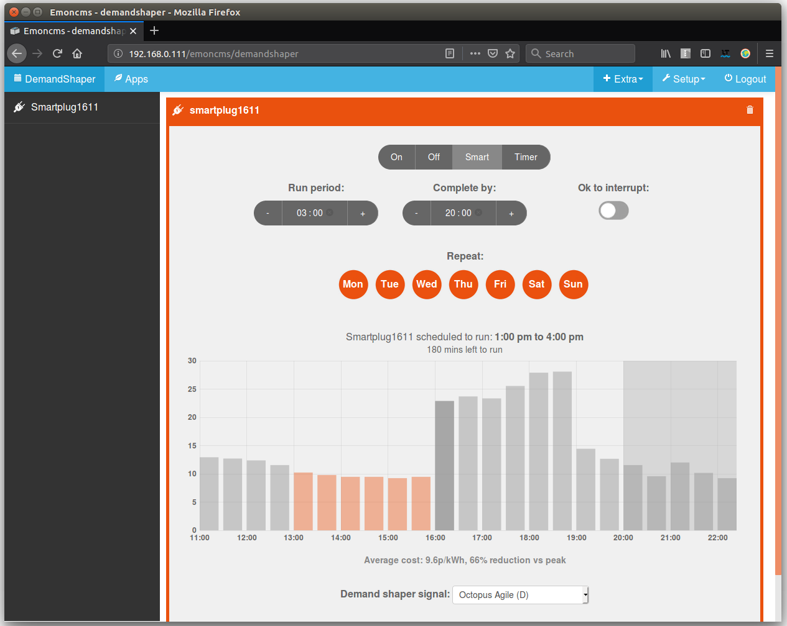
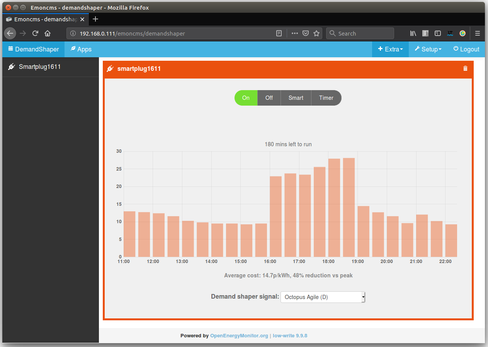
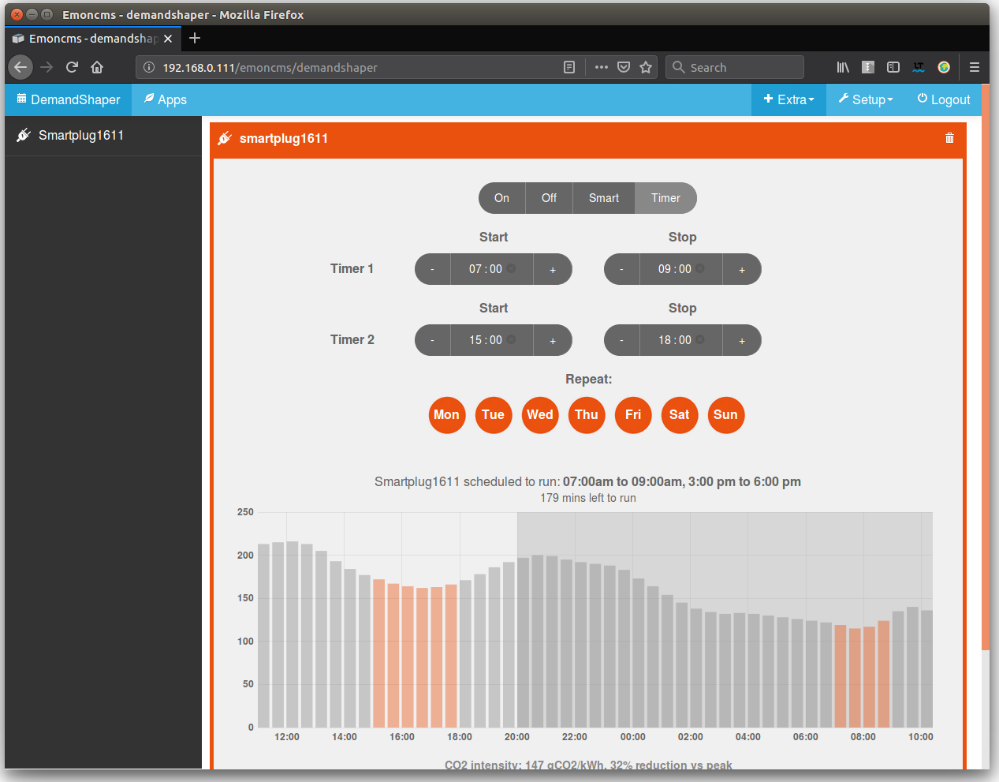
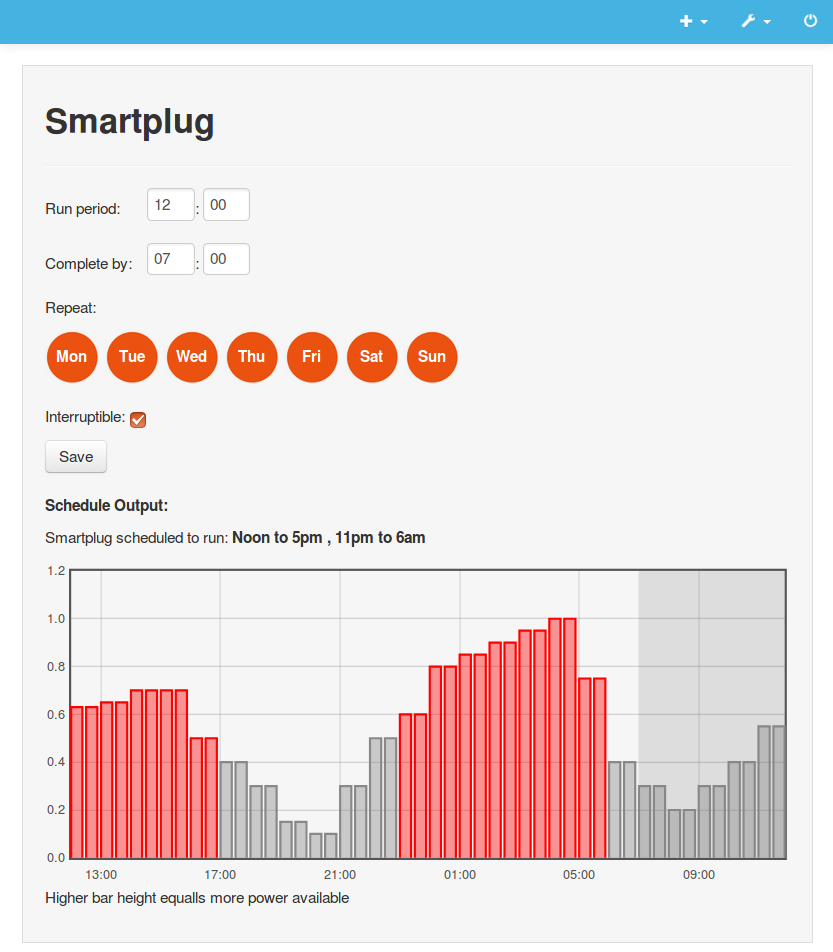
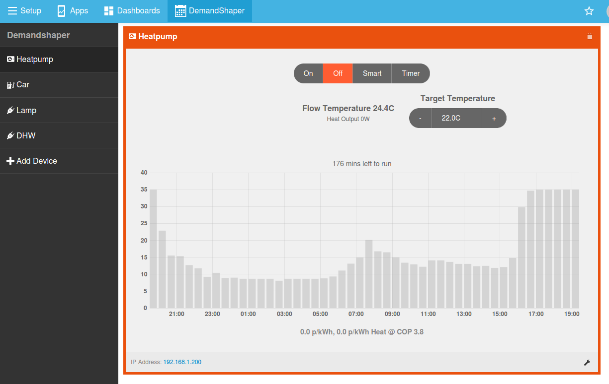
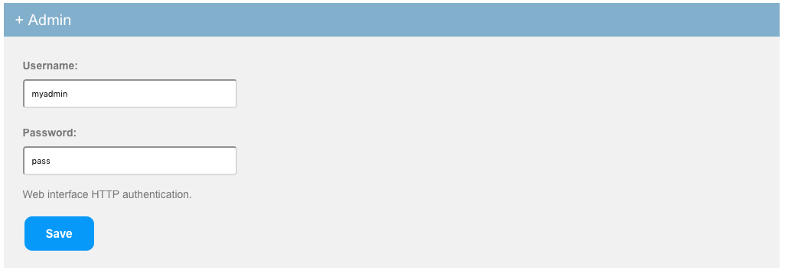

# Demand Shaper

Appliance, Smartplug, [WiFi Relay](https://shop.openenergymonitor.com/wifi-mqtt-relay-thermostat/), [EmonEVSE / OpenEVSE EV Charging Station](https://guide.openenergymonitor.org/integrations/ev-charging/), [HeatpumpMonitor](https://heatpumpmonitor.org/) demand shaper: Find the best time to run a household load.

The demand shaper module uses a day ahead power availability forecast and user set schedules to determine the best time to run household loads. An example could be charging an electric car, the user enters a desired completion time and charge duration, the demand shaper module then works out the best time to charge the car, generally there will be higher power availability overnight and during sunny midday hours. The demand shaper attempts to avoid running appliances at peak times while ensuring that the appliance has completed the required run period.

Developed as part of the CydYnni EnergyLocal project, see:
[https://community.openenergymonitor.org/t/cydynni-energylocal-community-hydro-smart-grid-blog-post](https://community.openenergymonitor.org/t/cydynni-energylocal-community-hydro-smart-grid-blog-post)

**9th November 2018:** The demand shaper module now supports the use of the [UK grid carbon intensity](https://carbonintensity.org.uk) and [Octopus Agile](https://octopus.energy/agile/) forecasts.

## Requirements

- Emoncms
- Emoncms Device module
- MQTT Mosquitto broker and MQTT emoncms setup as per emonSD image
- Redis

---

## Installation

Download or git clone the demandshaper repository to your home folder:

    cd
    git clone https://github.com/emoncms/demandshaper.git

Link the 'demandshaper-module' into the emoncms Modules folder:

    ln -s /home/pi/demandshaper/demandshaper-module /var/www/emoncms/Modules/demandshaper

Update emoncms database

    Setup > Administration > Update database > Update & Check

Install demandshaper service:

    sudo ln -s /home/pi/demandshaper/demandshaper.service /lib/systemd/system
    sudo systemctl enable demandshaper.service
    sudo systemctl start demandshaper

Add enable_UDP_broadcast setting to emoncms/settings.php to enable automatic WIFI device setup:

    $enable_UDP_broadcast = true;

Optional: Enable the periodic UDP broadcast script on the emonbase/emonpi:

<pre>
    crontab -e
    * * * * * php /home/pi/emonpi/UDPBroadcast/broadcast.php 2>&1
</pre>

---

## Using the Demand Shaper module with a SonOff S20 smart plug

Install the EmonESP (timer branch) firmware on a Sonoff S20 smartplug. There are pre-compiled binaries to make this step easier as well as the option to compile from source. See guide here: [https://github.com/openenergymonitor/EmonESP/blob/timer/sonoffS20.md](https://github.com/openenergymonitor/EmonESP/blob/timer/sonoffS20.md)

## User guide

1. The Sonoff S20 smartplug creates a WIFI access point, connect to the access point and enter home WIFI network. That is all the configuration required.

<table><tr><td>

</td><td>

</td></tr></table>

2. Connect back to your home WIFI network. Login to emoncms and navigate to the DeviceShaper module (in the extras menu). Wait until a popup appears asking to connect:

<table><tr><td>

</td><td>

</td></tr></table>

*What happened here?: The smart plug discovers the emonbase/emonpi automatically by listening out for the periodic UDP packet published by the emonbase/emonpi, enabled by the UDP broadcast script and triggered by keeping the demandshaper page open*

3. After clicking allow and waiting a minute or so, the smart plug will then appear:

*What happened here?: The smart plug received the MQTT authentication details from the emonbase/emonpi automatically as part of a pairing process enabled by clicking on Allow. After connecting to MQTT the smartplug sent a descriptor message that automatically created and configured an emoncms device based on the smartplug device template in the emoncms device module.*

---

### Option 1: Turn On/Off directly

The most basic mode of operation, turn on/off device from the interface:

### Option 2: Use the smart scheduler

Enter the period and end time of the schedule you wish to set and the demand shaper module will do the rest, automatically optimising the schedule for the lowest cost or lowest carbon time.

### Option 3: Set a manual timer:

Set a manual timer for specific run times:

### OpenEVSE / EmonEVSE electric car charger interface

The module contains custom interfaces for applications such as EV charging where you can drag drop the battery level state of charge to the desired target, the module then calculates the required run time based on the battery size and charger charge rate (hard coded at present, but will be configurable from the interface):

### Heatpump Control

Integrates the ability to control a Mitsubushi EcoDan heatpump with FTC2B controller connected to the OpenEnergyMonitor HeatpumpMonitor. Flow temperature and heating On/Off is settable from the interface.

---

Submit schedule:

    /emoncms/demandshaper/submit?schedule={
        "active":1,
        "period":3,
        "end":16,
        "repeat":[1,1,1,1,1,1,1],
        "interruptible":0,
        "runonce":false,
        "basic":0,
        "signal":"carbonintensity",
        "device":"openevse"
    }

Response:

    {
        "schedule":{
            "active":1,
            "period":3,
            "end":16,
            "repeat":[1,1,1,1,1,1,1],
            "interruptible":0,
            "runonce":false,
            "basic":0,
            "signal":"carbonintensity",
            "device":"openevse",
            "timeleft":2982,
            "end_timestamp":1544803200,
            "periods":[
                {"start":[1544799600,15],"end":[1544803200,16]}
            ],
            "probability":[[1544799600000,328,15,1,1],[1544801400000,331,15.5,1,1],[1544803200000,333,16,0,0],[1544805000000,334,16.5,0,0],[1544806800000,334,17,0,0],[1544808600000,334,17.5,0,0],[1544810400000,334,18,0,0],[1544812200000,335,18.5,0,0],[1544814000000,337,19,0,0],[1544815800000,339,19.5,0,0],[1544817600000,343,20,0,0],[1544819400000,347,20.5,0,0],[1544821200000,350,21,0,0],[1544823000000,351,21.5,0,0],[1544824800000,348,22,0,0],[1544826600000,337,22.5,0,0],[1544828400000,318,23,0,0],[1544830200000,295,23.5,0,0],[1544832000000,273,0,0,0],[1544833800000,254,0.5,0,0],[1544835600000,239,1,0,0],[1544837400000,228,1.5,0,0],[1544839200000,223,2,0,0],[1544841000000,221,2.5,0,0],[1544842800000,221,3,0,0],[1544844600000,219,3.5,0,0],[1544846400000,214,4,0,0],[1544848200000,208,4.5,0,0],[1544850000000,200,5,0,0],[1544851800000,191,5.5,0,0],[1544853600000,183,6,0,0],[1544855400000,179,6.5,0,0],[1544857200000,177,7,0,0],[1544859000000,180,7.5,0,0],[1544860800000,185,8,0,0],[1544862600000,192,8.5,0,0],[1544864400000,199,9,0,0],[1544866200000,208,9.5,0,0],[1544868000000,219,10,0,0],[1544869800000,232,10.5,0,0],[1544871600000,244,11,0,0],[1544873400000,253,11.5,0,0],[1544875200000,260,12,0,0],[1544877000000,264,12.5,0,0],[1544878800000,266,13,0,0],[1544880600000,266,13.5,0,0],[1544882400000,266,14,0,0]]
        }
    }

## Remote Cache

The remote cache currently run's on emoncms.org to reduce the potential API load on the Octopus and CarbonIntensity servers. The cache provides the following routes:

    https://emoncms.org/demandshaper/carbonintensity
    https://emoncms.org/demandshaper/octopus

To install and use the cache on your own server. Symlink emoncms-remote module to Modules folder:

    ln -s /home/username/demandshaper/emoncms-remote /var/www/emoncms/Modules/demandshaper

Add the cron entry:

    0 * * * * php /home/username/demandshaper/emoncms_remote_cache.php >> /var/log/demandshaper-cache.log

## Security

Already, MQTT control requires a password, this provides a basic level of security..
To minimise additional risk, be sure to create an admin username and password in emonESP, this will limit access to the device.

