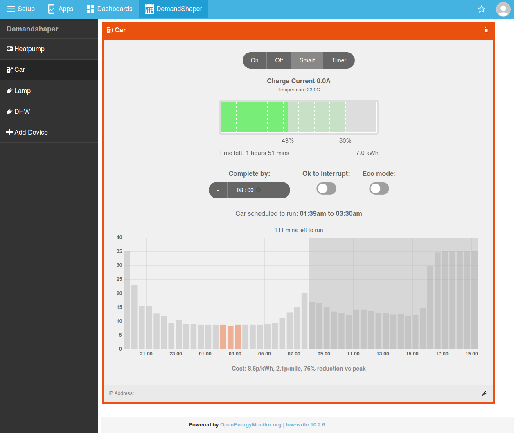

# Demand Shaper

Appliance, Smartplug, OpenEVSE demand shaper: Find the best time to run household load.

The demand shaper module uses a day ahead power availability forecast and user set schedules to determine the best time to run household loads. An example could be charging an electric car, the user enters a desired completion time and charge duration, the demand shaper module then works out the best time to charge the car, generally there will be higher power availability overnight and during sunny midday hours. The demand shaper attempts to avoid running appliances at peak times while ensuring that the appliance has completed the required run period.

Developed as part of the CydYnni EnergyLocal project, see:
[https://community.openenergymonitor.org/t/cydynni-energylocal-community-hydro-smart-grid-blog-post](https://community.openenergymonitor.org/t/cydynni-energylocal-community-hydro-smart-grid-blog-post)

**9th November 2018:** The demand shaper module now supports the use of the UK grid carbon intensity and Octopus Agile forecasts.

## Requirements

- Emoncms
- Emoncms Device module
- MQTT Mosquitto broker and MQTT emoncms setup as per emonSD image
- Redis

## Installation 

Download or git clone the demandshaper repository to your home folder:

    cd
    git clone https://github.com/emoncms/demandshaper.git
    
Link the 'demandshaper-module' into the emoncms Modules folder:

    ln -s /home/pi/demandshaper/demandshaper-module /var/www/emoncms/Modules/demandshaper 
    
## Run

The demand shaper background process is called run.php. It can be ran manually with:

    php run.php

Or from cron with:

    crontab -e
    * * * * * php /home/pi/demandshaper/run.php 2>&1
    
The demand shaper process publishes the device state to an MQTT topic of the form:

    emon/devicename/state

## Remote Cache

The remote cache currently run's on emoncms.org to reduce the potential API load on the Octopus and CarbonIntensity servers. The cache provides the following routes:

    https://emoncms.org/demandshaper/carbonintensity
    https://emoncms.org/demandshaper/octopus

To install and use the cache on your own server. Symlink emoncms-remote module to Modules folder:

    ln -s /home/username/demandshaper/emoncms-remote /var/www/emoncms/Modules/demandshaper

Add the cron entry:

    0 * * * * php /home/username/demandshaper/emoncms_remote_cache.php >> /var/log/demandshaper-cache.log

